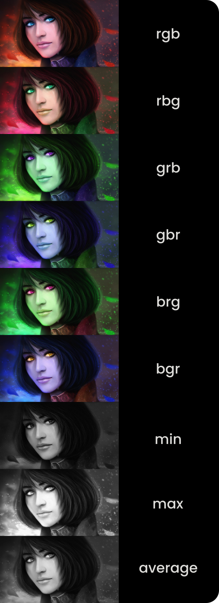

<br>

<h1 align="center">Procesamiento digital de imágenes</h1>
<p align="center">Permutador de canales RGB y escalas de grises</p>

<br>

A partir de una imagen de entrada, este script genera automáticamente:

* **6 combinaciones posibles de los canales RGB**:
  * `rgb`, `rbg`, `grb`, `gbr`, `brg`, `bgr`
* Una imagen en escala de grises por **valor máximo** de los canales RGB.
* Una imagen en escala de grises por **valor mínimo** de los canales RGB.
* Una imagen en escala de grises por **valor promedio** de los canales RGB.

<br>

## ¿Cómo funciona?

1. Solicita al usuario la ruta de una imagen (`.jpg`, `.png`, etc.).
2. Carga la imagen y genera:
   * Seis nuevas imágenes con los canales RGB reordenados.
   * Tres imágenes en escala de grises: usando el valor máximo, mínimo y promedio de los canales RGB.
3. Guarda todas las imágenes en el mismo directorio del script.

<br>

## Requisitos

* Python 3.x
* [Pillow (PIL)](https://pypi.org/project/Pillow/)

### Instalación de dependencias

```bash
pip install pillow
```

<br>

## Ejecución

```bash
py rgb_channels.py
Path img: ruta/imagen/relativa/o/absoluta.jpg
```

<br>

## Imagenes generadas

<p align="center">
  
</p>

<br>
